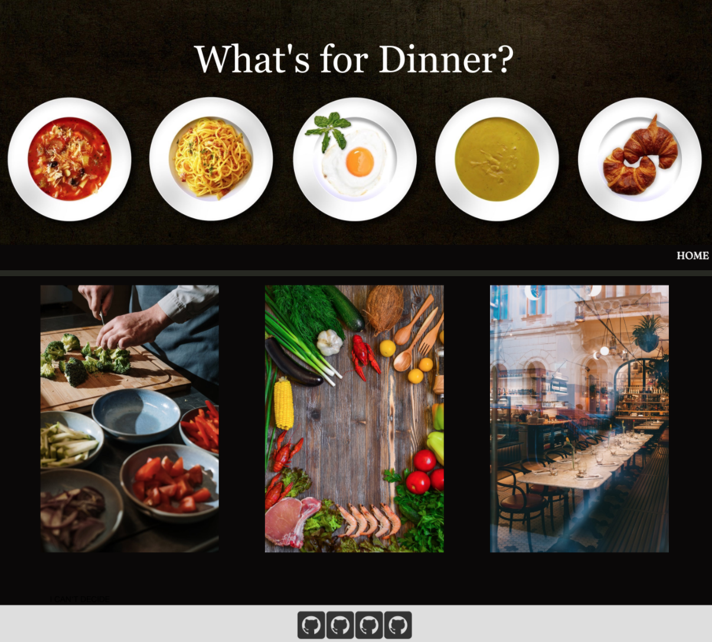

# portfolio
Hello, my name is B Tram Vu. I am a full stack web developer. My portfolio show case of my works as well as a little bit about myself and my passion. 

## Site Gif 


# Table of Contents
[Tittle](#portfolio)

[Site Picutre](#Site-Gif)

[Table of Contents](#Table-of-Content)

[Description of Page Building ](#Description-of-Page-Building)

[Code Snippet](#Code-Snippet)

[Technologies Used](#Technologies-Used)

[Deployed Link](#Deployed-Link)

[Author](#Author)

[License](#License)


## Description of Page Building 
* Create a index.html file, a style.css file, a BTVu.html, and a projects.html file
  
* In HTML file 
  <ul>
  <li> Build HTML in semantic structure
  <li> Link style page such as bootstrap, google font, foundation 
  <li> Link files and links that are connected to index file
  <li> Create a Nav Bar to display full name, linkedIn and GitHub Page
  <li> Organize contents of work and peronal information
  <li> Add projects' desctiptions and deployed links to projects file
  <li> Construct rows/ collums/ cells/ cards as container for contents 
  <li> Add icons elements
  
  </li>
  </ul>

* In Style.Css file 
  <ul> 
  <li> Add background color
  <li> Link background image
  <li> Create hover buttons and letters 
  <li> Adjust letters' fonts and color to match the violet theme
  <li> Align elements to fit the page in a beautiful way
  </li>
  </ul>

## Code Snippet
Create a Nav Bar to display full name, linkedIn and GitHub Page
```html
  <nav class="navbar navbar-light bg-light justify-content-md-between justify-content-center" id="top-nav">
    <a class="navbar-brand text-center" href="index.html" id="b-name" style="padding:5px">
      <h3 style="margin-left:10px">B Tram Vu</h3>
    </a>
    <a href="https://www.linkedin.com/in/b-tram-vu-866250121/"></a>
    <a href="https://github.com/vubao2303"><i id="social-em" class="fab fa-github-square fa-3x social"></i></a>   
  </nav>
```
Use foundation to add dymanic style to the page 
```html
 <div class="grid-x grid-padding-x">
  <div class="cell small-12 medium-6 large-8">
    <a href="https://vubao2303.github.io/Project-1/" target="_blank"></a>
    <div class="middle">
      <a href="https://vubao2303.github.io/Project-1/"><h2>SEE LIVE SITE</h2></a>
    </div>
  </div>
  <div class="cell small-12 medium-6 large-4" style="margin-top: 10px;">
    <p class="p-description"> Project descriptions
      <br/><a href="https://github.com/vubao2303/Project-1">GITHUBLINK</a>
    </p>
  </div>
</div>
```

Make footer that contain contact and resume sticky
```css
footer {
  position: sticky;
  position: -webkit-sticky; 
  position: sticky;
  bottom: 0px;
  background:rgb(150, 196, 205);
  height:60px; 
  font-size: 20px;
}
```

## Technologies Used
- HTML - used to create elements on the DOM
  * [HTML](https://developer.mozilla.org/en-US/docs/Web/HTML)
- CSS - styles html elements on page
  * [CSS](https://developer.mozilla.org/en-US/docs/Web/CSS)
- Javascript - gives interacticve elements to web pages
  * [Javascript](https://developer.mozilla.org/en-US/docs/Web/JavaScript)
- Bootstrap - design and customize responsive site
  * [Bootstrap](https://getbootstrap.com/)
- Git - version control system to track changes to source code
  * [Git](https://git-scm.com/)
- GitHub - hosts repository that can be deployed to GitHub Pages
  * [Github](https://github.com/)
- Foudation - Responsive CSS frameworks 
  * [Foundation](https://get.foundation/)


## Deployed Link

* [See Live Site](https://vubao2303.github.io/portfolio/)


## Author

* **B Tram Vu** 

- [Link to Portfolio Site](https://github.com/vubao2303)
- [Link to Github](https://github.com/vubao2303)
- [Link to LinkedIn](https://www.linkedin.com/in/tram-vu-866250121/)

## License
© 2020 Trilogy Education Services, a 2U, Inc. brand. All Rights Reserved.


